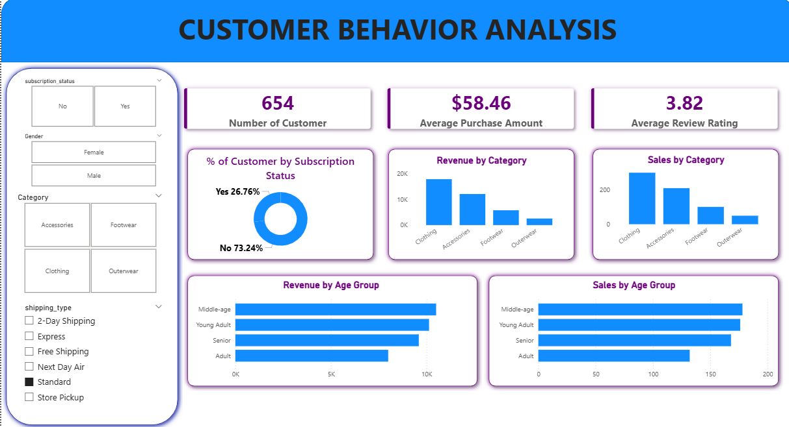

# Customer Shopping Behavior Analysis

##  Project Overview
This project analyzes customer shopping behavior using transactional data of 3,900 purchases. The goal is to uncover insights into spending patterns, customer segmentation, product preferences, and subscription behavior to support business decision-making.

---

##  Dataset Information
- Total Records: 3,900
- Features: 18 columns
- Includes:
  - Customer demographics (Age, Gender, Location, Subscription Status)
  - Purchase details (Item, Category, Amount, Season, Size, Color)
  - Behavior data (Discount, Frequency, Review Rating, Shipping Type)
- Missing Values: Handled in `Review Rating` column

---

##  Tech Stack
- Python (Pandas, NumPy, Matplotlib, Seaborn)
- PostgreSQL (SQL Analysis)
- Power BI (Dashboard Visualization)

---

##  Data Processing Steps
- Data Cleaning and preprocessing
- Handling missing values using median (category-wise)
- Feature engineering:
  - Age group segmentation
  - Purchase frequency
- Removed redundant columns
- Loaded cleaned data into PostgreSQL

---

##  Key Analysis (SQL)
- Revenue comparison by gender
- High-spending customers using discounts
- Top 5 products by rating
- Shipping type vs purchase behavior
- Subscribers vs non-subscribers analysis
- Discount-dependent products
- Customer segmentation (New, Returning, Loyal)
- Top products per category
- Repeat buyers vs subscriptions
- Revenue by age group

---

##  Dashboard (Power BI)
An interactive dashboard was created to visualize:
- Total customers and revenue
- Category-wise sales
- Age group analysis
- Subscription insights
- Average purchase and ratings

---

##  Key Insights
- Male customers generated higher revenue than female customers
- Express shipping users spend slightly more
- Loyal customers dominate the dataset
- Certain products heavily depend on discounts
- Young adults contribute the highest revenue

---

